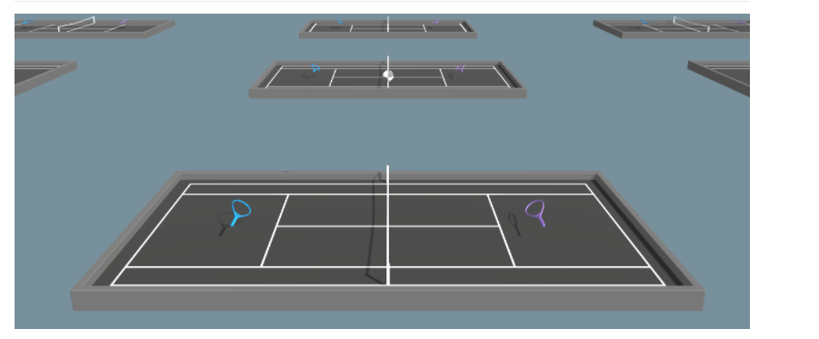
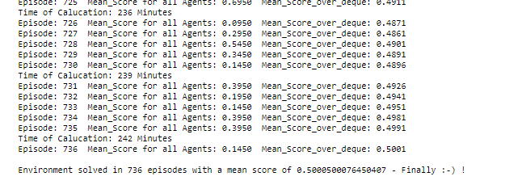
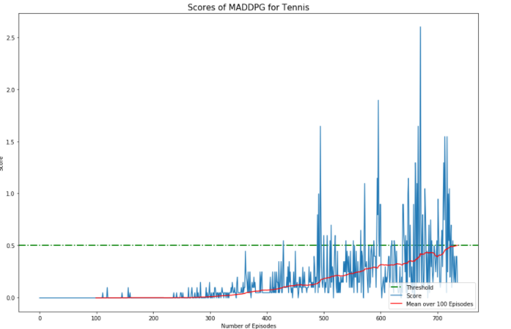

# Project - Collaboration and Competition

## Introduction

(Source: [Unity](https://github.com/Unity-Technologies/ml-agents/blob/master/docs/Learning-Environment-Examples.md))

The Environment consists of Tennis-Player (the agents), which should be able to play Tennis with each other. The Goal is to play the ball over the net and for each successful attempt, the corresponding agent gets an reward of 0.1, but if an agent let's the ball hit the ground or hit's the ball out of bounds, he will receive an reward of -0.01. This is an episodic Task, where the rewards after an episode are going to be summed up for each agent. 

This version is slightly different from the [Unity version](https://github.com/Unity-Technologies/ml-agents/blob/master/docs/Learning-Environment-Examples.md). In contrast to the Unity-Version, the present Version has 8 Variables corresponding to position and velocity of the ball and the racket. Two Movement options are available: Moving horizontally (towards or away from the net) and vertically (jumping).

# Getting Started 

### Running the Agent

1. Follow the Python and Pytorch requirements mentioned in the [Udacity github](https://github.com/udacity/deep-reinforcement-learning#dependencies).  

2. Download the environment from one of the links below. You need only select the environment that matches your operating system:

   1. Version 1: One (1) Agent
      - Linux: [click here](https://s3-us-west-1.amazonaws.com/udacity-drlnd/P2/Reacher/one_agent/Reacher_Linux.zip)
      - Mac OSX: [click here](https://s3-us-west-1.amazonaws.com/udacity-drlnd/P2/Reacher/one_agent/Reacher.app.zip)
      - Windows (32-bit): [click here](https://s3-us-west-1.amazonaws.com/udacity-drlnd/P2/Reacher/one_agent/Reacher_Windows_x86.zip)
      - Windows (64-bit): [click here](https://s3-us-west-1.amazonaws.com/udacity-drlnd/P2/Reacher/one_agent/Reacher_Windows_x86_64.zip)

   2. Version 2: Twenty (20) Agents
      - Linux: [click here](https://s3-us-west-1.amazonaws.com/udacity-drlnd/P2/Reacher/Reacher_Linux.zip)
      - Mac OSX: [click here](https://s3-us-west-1.amazonaws.com/udacity-drlnd/P2/Reacher/Reacher.app.zip)
      - Windows (32-bit): [click here](https://s3-us-west-1.amazonaws.com/udacity-drlnd/P2/Reacher/Reacher_Windows_x86.zip)
      - Windows (64-bit): [click here](https://s3-us-west-1.amazonaws.com/udacity-drlnd/P2/Reacher/Reacher_Windows_x86_64.zip)

3. Download the Repo and the Environment and place all Files in the same Folder, and unzip (or decompress) the files if necessary. 

### Instructions

Follow the instructions in `Tennis.ipynb` to get started with training your own agent! Caution: It might take a while (in my Case about 4 Hours) to finish Training. 

# Results 

The Environment was solved in 736 Episodes with a mean Score of 0.50005. 

The training has been very steady and shows an even increase in scores. 

# Dependencies 

1. Pytorch
2.  UnityEnvironment
3. collections 
4. itertools 
5. time 
6. numpy 
7. pandas 
8. copy 
9. random 
10. matplotlib 